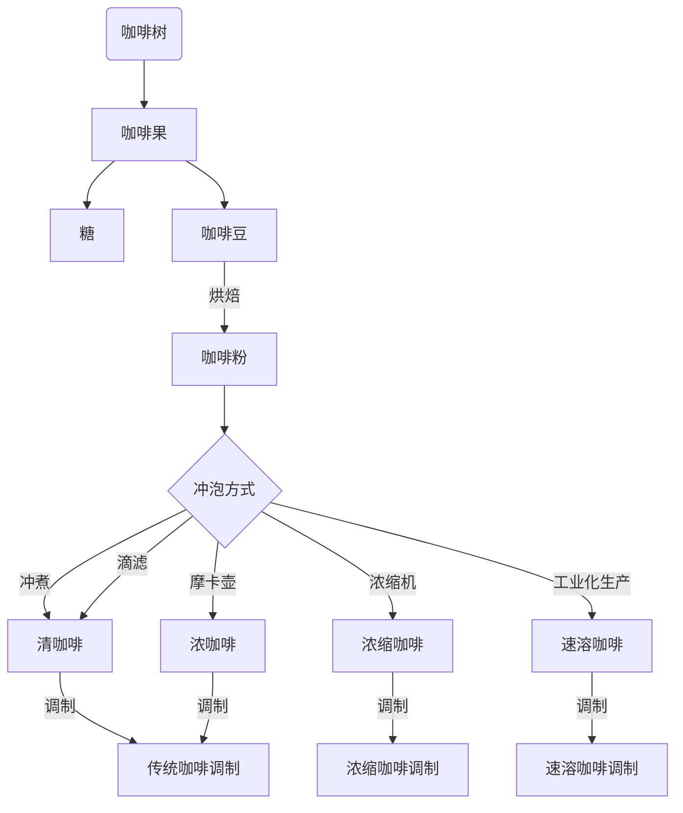

# New-Coffee-Workshop
Coffee Workshop

```mermaid
graph TB
    Start(咖啡树) --> Fruit[咖啡果]
    Fruit --> Sugar[糖]
    Fruit --> Bean[咖啡豆]
    Bean -->|烘焙| Powder[咖啡粉]
    Powder --> Ways{"冲泡方式"}
    Ways -->|冲煮| Black[清咖啡]
    Ways -->|滴滤| Black[清咖啡]
    Ways -->|摩卡壶| Strong[浓咖啡]
    Ways -->|浓缩机| Espresso[浓缩咖啡]
    Ways -->|工业化生产| Instant[速溶咖啡]
    Black -->|调制| TBase[传统咖啡调制]
    Strong -->|调制| TBase[传统咖啡调制]
    Espresso -->|调制| EBase[浓缩咖啡调制]
    Instant -->|调制| IBase[速溶咖啡调制]
```
